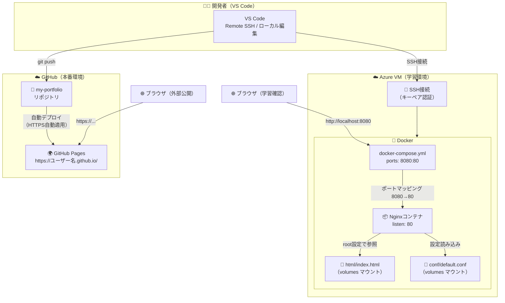
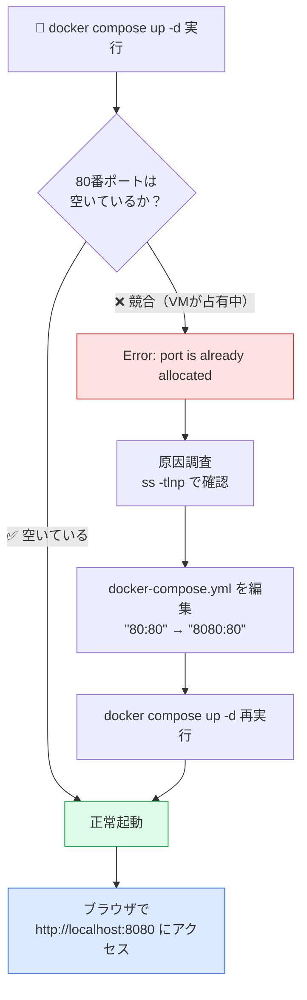
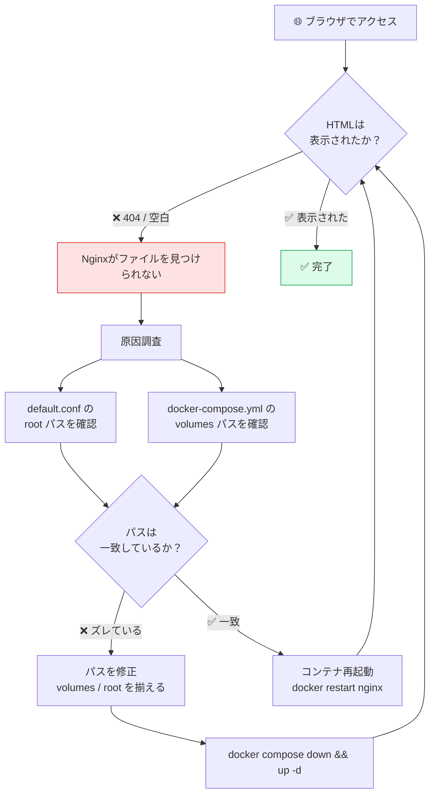
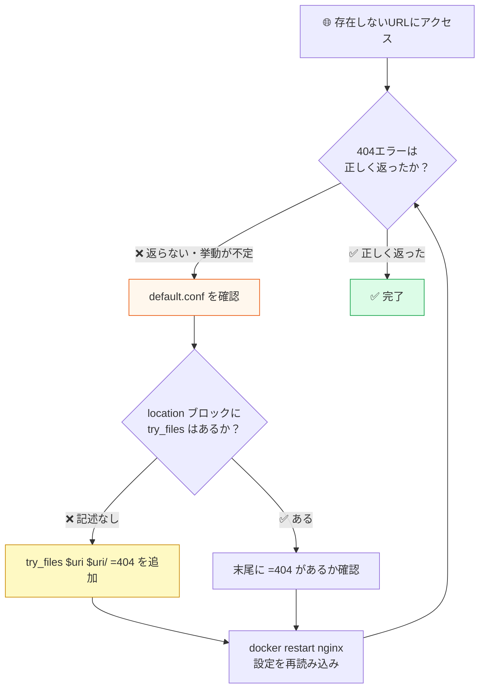
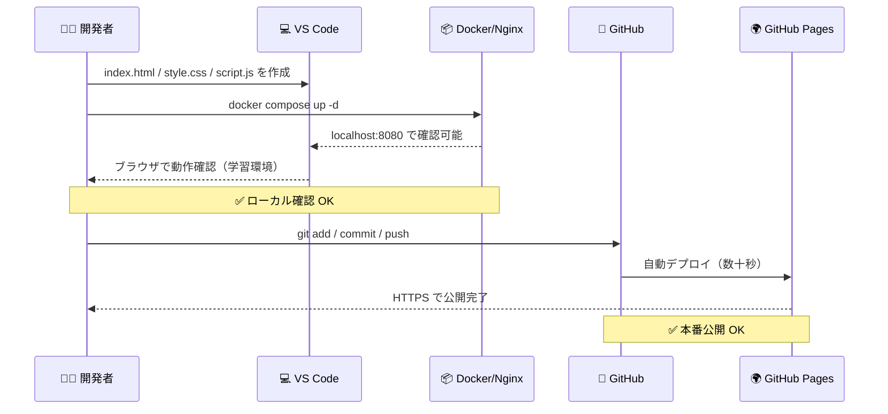
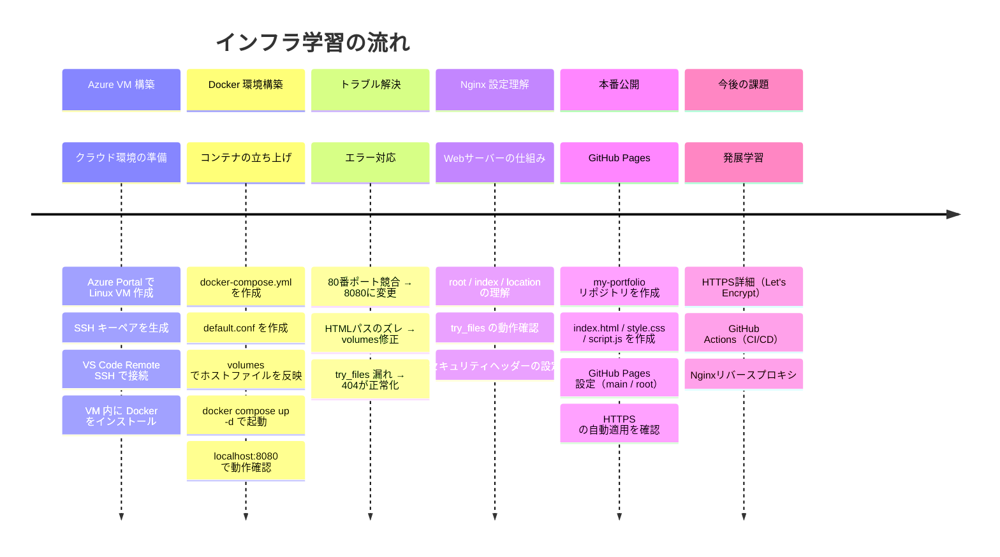

---
# 学習ログ全体構成図
---

## 1. システム全体構成図

---

## 2. トラブル① ポート競合の解決フロー

---

## 3. トラブル② HTMLが表示されない問題の解決フロー

---

## 4. トラブル③ 404エラーが正しく返らない（try_files 設定漏れ）

---

## 5. デプロイ・公開フロー

---

## 6. 学習ロードマップ

