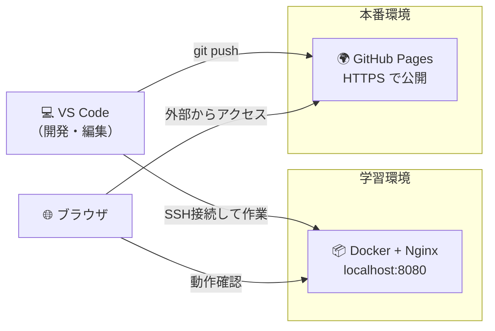
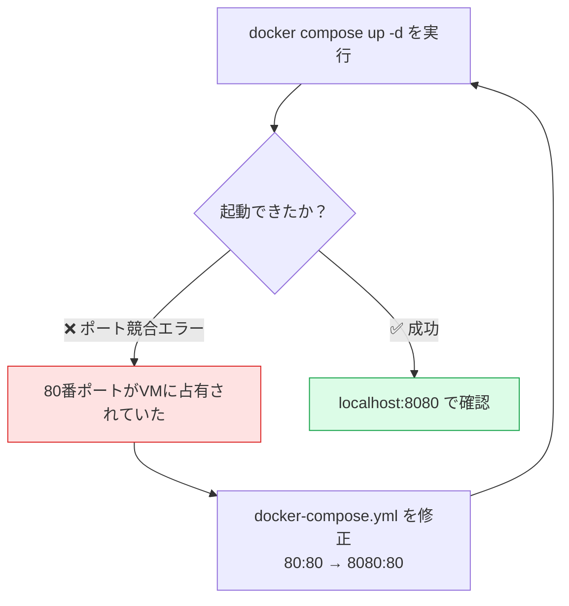
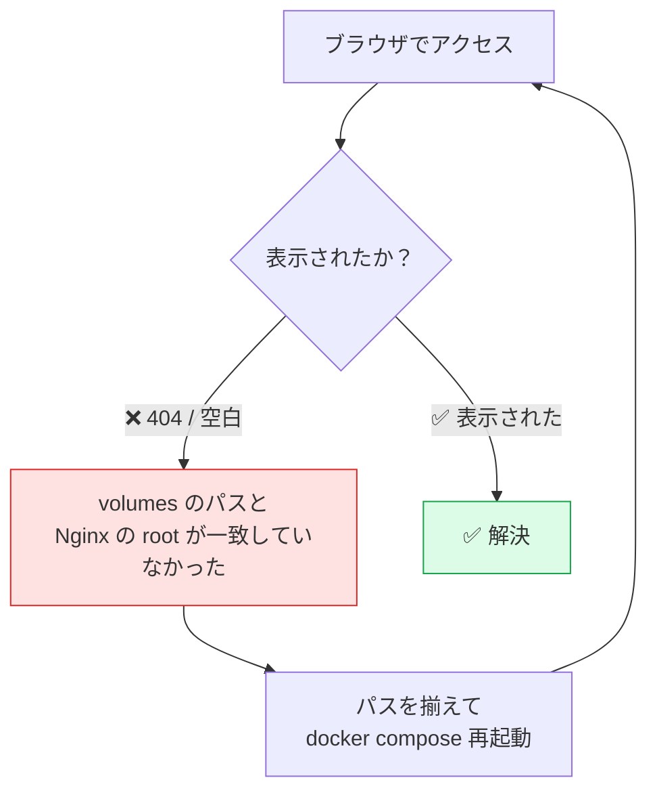
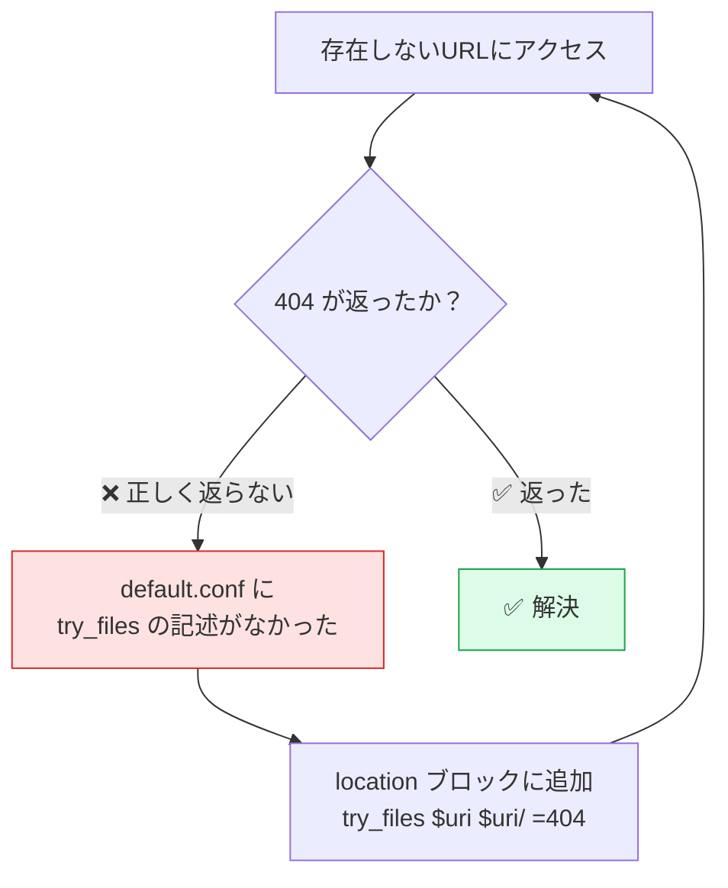
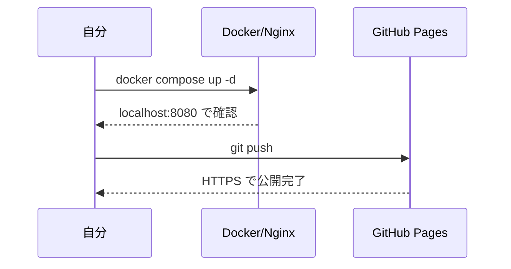
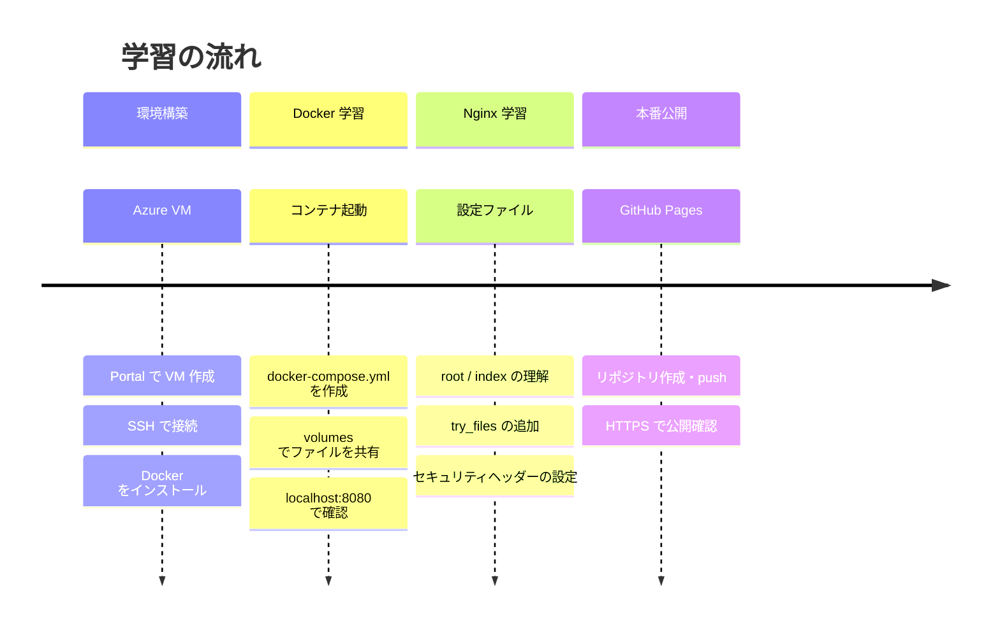

# 構成図・学習フロー図

---

## 1. システム全体構成図

```mermaid
graph LR
    DEV["💻 VS Code\n（開発・編集）"]

    subgraph LEARN["学習環境"]
        NGINX["📦 Docker + Nginx\nlocalhost:8080"]
    end

    subgraph PROD["本番環境"]
        PAGES["🌍 GitHub Pages\nHTTPS で公開"]
    end

    DEV -->|"SSH接続して作業"| NGINX
    DEV -->|"git push"| PAGES
    BROWSER["🌐 ブラウザ"] -->|"動作確認"| NGINX
    BROWSER -->|"外部からアクセス"| PAGES
```

---

## 2. トラブル① ポート競合の解決

```mermaid
flowchart TD
    A["docker compose up -d を実行"] --> B{"起動できたか？"}
    B -->|"❌ ポート競合エラー"| C["80番ポートがVMに占有されていた"]
    B -->|"✅ 成功"| E["localhost:8080 で確認"]

    C --> D["docker-compose.yml を修正\n80:80 → 8080:80"]
    D --> A

    style C fill:#fee2e2,stroke:#dc2626
    style E fill:#dcfce7,stroke:#16a34a
```

---

## 3. トラブル② HTML が表示されない

```mermaid
flowchart TD
    A["ブラウザでアクセス"] --> B{"表示されたか？"}
    B -->|"❌ 404 / 空白"| C["volumes のパスと\nNginx の root が一致していなかった"]
    B -->|"✅ 表示された"| E["✅ 解決"]

    C --> D["パスを揃えて\ndocker compose 再起動"]
    D --> A

    style C fill:#fee2e2,stroke:#dc2626
    style E fill:#dcfce7,stroke:#16a34a
```

---

## 4. トラブル③ 404 が正しく返らない

```mermaid
flowchart TD
    A["存在しないURLにアクセス"] --> B{"404 が返ったか？"}
    B -->|"❌ 正しく返らない"| C["default.conf に\ntry_files の記述がなかった"]
    B -->|"✅ 返った"| E["✅ 解決"]

    C --> D["location ブロックに追加\ntry_files $uri $uri/ =404"]
    D --> A

    style C fill:#fee2e2,stroke:#dc2626
    style E fill:#dcfce7,stroke:#16a34a
```

---

## 5. 公開までの流れ

```mermaid
sequenceDiagram
    participant 自分
    participant Docker/Nginx
    participant GitHub Pages

    自分 ->> Docker/Nginx: docker compose up -d
    Docker/Nginx -->> 自分: localhost:8080 で確認
    自分 ->> GitHub Pages: git push
    GitHub Pages -->> 自分: HTTPS で公開完了
```

---

## 6. 学習ロードマップ

```mermaid
timeline
    title 学習の流れ
    section 環境構築
        Azure VM     : Portal で VM 作成
                     : SSH で接続
                     : Docker をインストール
    section Docker 学習
        コンテナ起動 : docker-compose.yml を作成
                     : volumes でファイルを共有
                     : localhost:8080 で確認
    section Nginx 学習
        設定ファイル : root / index の理解
                     : try_files の追加
                     : セキュリティヘッダーの設定
    section 本番公開
        GitHub Pages : リポジトリ作成・push
                     : HTTPS で公開確認
```
